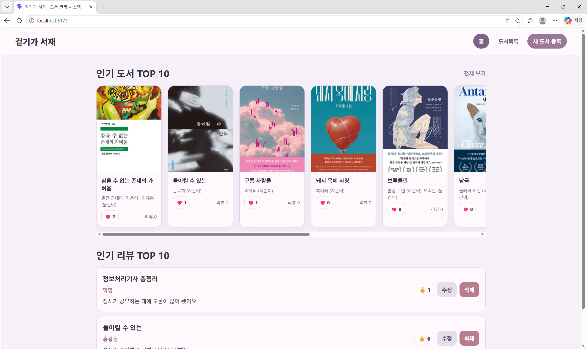
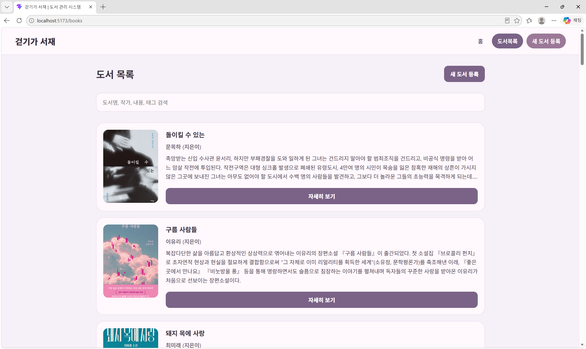
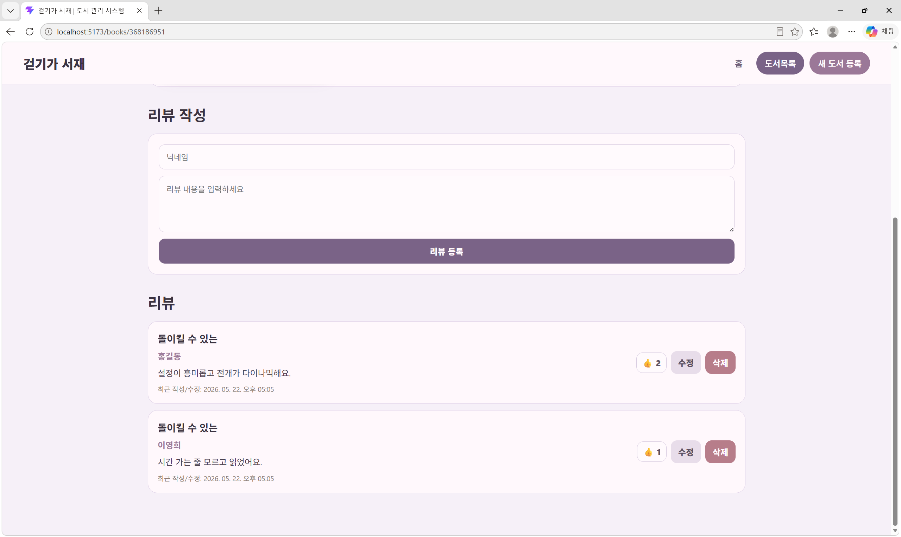
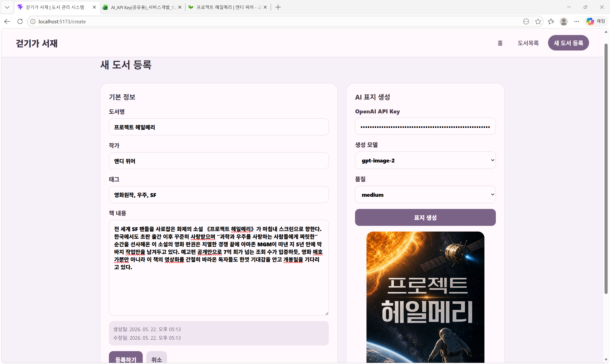
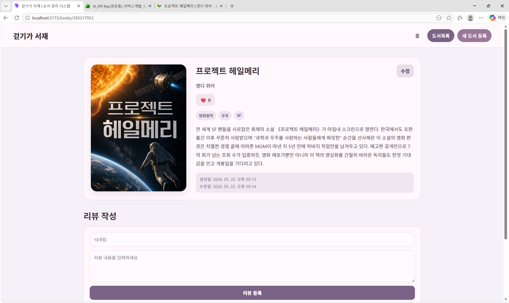

# 걷기가 서재 - AI 표지 생성 도서 관리 시스템

## 프로젝트 소개

**걷기가 서재**는 사용자가 도서를 등록하고, 도서별 리뷰를 작성하며, OpenAI 이미지 생성 API를 활용해 책 내용에 어울리는 표지를 생성할 수 있는 프론트엔드 기반 도서 관리 웹 애플리케이션입니다.

기존의 단순한 텍스트 중심 도서 관리 방식에서 벗어나, 책의 제목과 내용, 태그를 기반으로 AI 표지를 생성하여 사용자가 더 직관적이고 감성적으로 도서를 관리할 수 있도록 기획했습니다.

---

## 주요 기능

### 1. 홈 화면

- 좋아요 수가 높은 도서 TOP 10 표시
- 좋아요 수가 높은 리뷰 TOP 10 표시
- 도서 카드 클릭 시 상세 페이지 이동
- 리뷰 카드 클릭 시 해당 도서 상세 페이지 이동
- 도서 좋아요 기능
- 리뷰 좋아요 / 수정 / 삭제 기능

### 2. 도서 목록 페이지

- 전체 도서 목록 조회
- 도서명, 작가, 내용, 태그 기반 검색 기능
- 도서 카드별 표지, 제목, 요약 내용 표시
- `자세히 보기` 버튼을 통한 상세 페이지 이동

### 3. 새 도서 등록 / 수정 페이지

- 도서명, 작가, 태그, 책 내용 입력
- 생성일 / 수정일 자동 관리
- OpenAI API Key 입력
- 이미지 생성 모델 및 품질 선택
- 책 내용 기반 AI 표지 생성
- 생성된 표지를 도서 정보와 함께 저장
- 기존 도서 수정 시 기존 데이터 유지 후 수정 가능

### 4. 책 상세 페이지

- 책 표지, 제목, 작가, 좋아요 수, 태그, 내용 표시
- 도서 좋아요 기능
- 도서 수정 페이지 이동
- 해당 도서에 달린 리뷰 목록 조회
- 리뷰 작성 기능
- 리뷰 좋아요 / 수정 / 삭제 기능
- 리뷰는 최신 작성 또는 수정 시간 기준으로 정렬

---

## 기술 스택

| 구분 | 기술 |
|---|---|
| Frontend | React, Vite |
| Routing | React Router DOM |
| Mock Backend | json-server |
| API 통신 | Fetch API |
| AI 기능 | OpenAI Image Generation API |
| Styling | CSS |
| Data | db.json |

---

## 프로젝트 구조

```bash
src
├─ App.jsx
├─ main.jsx
├─ App.css
├─ index.css
│
├─ pages
│  ├─ HomePage.jsx
│  ├─ ListPage.jsx
│  ├─ CreatePage.jsx
│  └─ DetailPage.jsx
│
└─ components
   ├─ Header.jsx
   ├─ api.js
   ├─ utils.js
   │
   ├─ BookHomeList.jsx
   ├─ BookHomeItem.jsx
   │
   ├─ BookReportHomeList.jsx
   ├─ BookReportHomeItem.jsx
   │
   ├─ BookInventoryList.jsx
   ├─ BookInventoryItem.jsx
   │
   ├─ Create.jsx
   ├─ BookDetail.jsx
   │
   ├─ BookReportDetailList.jsx
   └─ BookReportDetailItem.jsx
```

---

## 컴포넌트 역할

| 컴포넌트 | 역할 |
|---|---|
| `App.jsx` | 전체 라우팅 구조 관리 |
| `Header.jsx` | 홈, 도서목록, 새 도서 등록 이동 네비게이션 |
| `HomePage.jsx` | 홈 화면 전체 구성 |
| `BookHomeList.jsx` | 홈 화면의 인기 도서 TOP 10 리스트 |
| `BookHomeItem.jsx` | 인기 도서 카드 1개 표시 |
| `BookReportHomeList.jsx` | 홈 화면의 인기 리뷰 TOP 10 리스트 |
| `BookReportHomeItem.jsx` | 인기 리뷰 카드 1개 표시 |
| `ListPage.jsx` | 도서 목록 페이지 전체 구성 |
| `BookInventoryList.jsx` | 전체 도서 리스트 렌더링 |
| `BookInventoryItem.jsx` | 도서 목록 카드 1개 표시 |
| `CreatePage.jsx` | 새 도서 등록 / 수정 페이지 |
| `Create.jsx` | 도서 입력 폼 및 AI 표지 생성 기능 |
| `DetailPage.jsx` | 책 상세 페이지 전체 구성 |
| `BookDetail.jsx` | 책 상세 정보 표시 |
| `BookReportDetailList.jsx` | 특정 책에 대한 리뷰 리스트 |
| `BookReportDetailItem.jsx` | 리뷰 카드 1개 표시 |
| `api.js` | json-server 요청을 처리하는 공통 API 함수 |
| `utils.js` | 날짜 포맷, 태그 정리 등 공통 유틸 함수 |

---

## 데이터 구조

이 프로젝트는 `json-server`를 사용하며, `db.json` 하나 안에서 `books`와 `reviews` 리소스를 분리하여 관리합니다.

```json
{
  "books": [
    {
      "id": 1,
      "title": "도서 제목",
      "author": "작가명",
      "tag": ["한국소설", "SF"],
      "likes": 0,
      "content": "도서 내용 또는 줄거리",
      "coverImageUrl": "표지 이미지 URL 또는 Data URL",
      "createdAt": "2026-05-22T09:00:00.000Z",
      "updatedAt": "2026-05-22T09:00:00.000Z"
    }
  ],
  "reviews": [
    {
      "id": 1,
      "bookId": 1,
      "bookTitle": "도서 제목",
      "nickname": "닉네임",
      "content": "리뷰 내용",
      "likes": 0,
      "createdAt": "2026-05-22T09:30:00.000Z",
      "updatedAt": "2026-05-22T09:30:00.000Z"
    }
  ]
}
```

### 데이터 설계 특징

- `books`와 `reviews`를 분리하여 1:N 관계 구현
- 하나의 도서에 여러 개의 리뷰 작성 가능
- 리뷰는 `bookId`를 통해 특정 도서와 연결
- 도서와 리뷰 모두 `likes`, `createdAt`, `updatedAt` 관리
- 도서 수정 또는 리뷰 수정 시 `updatedAt` 자동 갱신

---

## API 엔드포인트

`json-server` 실행 시 아래 엔드포인트를 사용할 수 있습니다.

| 기능 | Method | Endpoint |
|---|---|---|
| 도서 전체 조회 | GET | `/books` |
| 도서 상세 조회 | GET | `/books/:id` |
| 도서 등록 | POST | `/books` |
| 도서 수정 | PATCH | `/books/:id` |
| 도서 삭제 | DELETE | `/books/:id` |
| 리뷰 전체 조회 | GET | `/reviews` |
| 특정 도서 리뷰 조회 | GET | `/reviews?bookId=:bookId` |
| 리뷰 등록 | POST | `/reviews` |
| 리뷰 수정 | PATCH | `/reviews/:id` |
| 리뷰 삭제 | DELETE | `/reviews/:id` |

---

## AI 표지 생성 흐름

1. 사용자가 도서 제목, 태그, 책 내용을 입력한다.
2. 사용자가 OpenAI API Key를 입력한다.
3. 생성 모델과 품질을 선택한다.
4. 도서 제목과 내용을 기반으로 이미지 생성 프롬프트를 구성한다.
5. OpenAI Image Generation API에 요청을 보낸다.
6. 응답으로 받은 `b64_json`을 Data URL로 변환한다.
7. 변환된 이미지를 `coverImageUrl`에 저장한다.
8. 등록 또는 수정 완료 시 `db.json`에 반영된다.

```js
const imageSrc = `data:image/png;base64,${b64Json}`;
```

API Key는 보안을 위해 코드에 직접 저장하지 않고, 화면에서 입력받는 방식으로 구현했습니다.

---

## UI/UX 특징

- 채도 낮은 핑크~라벤더 계열의 컬러 팔레트 적용
- 도서 카드는 표지 중심의 카드형 UI로 구성
- 홈 화면에서는 가로 스크롤 도서 카드 영역 제공
- 리뷰는 게시판형 세로 리스트로 구성
- 좋아요 수는 도서는 `❤️ 1`, 리뷰는 `👍 1` 형식으로 표시
- 등록/수정 페이지는 기본 정보 영역과 AI 표지 생성 영역을 분리하여 구성

---

## 실행 방법

### 1. 패키지 설치

```bash
npm install
```

React Router가 설치되어 있지 않다면 아래 명령어를 실행합니다.

```bash
npm install react-router-dom
```

### 2. json-server 실행

```bash
npx json-server@0.17.4 --watch db.json --port 3000
```

실행 후 아래 주소에서 데이터를 확인할 수 있습니다.

```bash
http://localhost:3000/books
http://localhost:3000/reviews
```

### 3. React 개발 서버 실행

새 터미널을 열고 아래 명령어를 실행합니다.

```bash
npm run dev
```

기본 실행 주소는 다음과 같습니다.

```bash
http://localhost:5173
```

---

## 주요 화면

### 홈 화면

- 인기 도서 TOP 10
- 인기 리뷰 TOP 10



### 도서 목록 화면

- 전체 도서 조회
- 검색 기능



### 책 상세 화면

- 도서 상세 정보
- 리뷰 작성 및 리뷰 목록

.png)



### 도서 등록 화면

- 도서 정보 입력
- AI 표지 생성





---

## 담당 역할

- 도서 및 리뷰 데이터 구조 설계
- `db.json` 기반 Mock API 설계
- 도서 목록 / 상세 / 등록 / 수정 화면 구조 설계
- 리뷰 게시판 기능 설계
- 좋아요 기능 구현
- OpenAI API 기반 AI 표지 생성 흐름 설계
- CSS 컬러 팔레트 및 화면 스타일 조정
- 컴포넌트 역할 분리 및 구조 정리

---

## 구현하며 고민한 점

### 1. 도서와 리뷰 데이터 분리

처음에는 도서 객체 안에 리뷰를 포함하는 방식도 고려했지만, 하나의 도서에 여러 리뷰가 달리는 구조이므로 `books`와 `reviews`를 분리했습니다. 리뷰에는 `bookId`를 저장하여 어떤 도서에 달린 리뷰인지 연결했습니다.

### 2. 등록과 수정을 같은 폼에서 처리

새 도서 등록과 기존 도서 수정은 입력 필드가 거의 동일하기 때문에 하나의 폼 컴포넌트를 재사용했습니다. URL에 `id`가 있는 경우 수정 모드로 동작하게 하여 중복 코드를 줄였습니다.

### 3. AI 표지 생성 이미지 저장 방식

OpenAI API 응답에서 받은 base64 문자열을 Data URL로 변환한 뒤 `coverImageUrl`에 저장했습니다. 이를 통해 별도의 이미지 서버 없이도 json-server 기반 프로젝트에서 생성된 표지를 바로 화면에 표시할 수 있도록 했습니다.

### 4. 홈 화면 데이터 정렬

홈 화면에서는 도서와 리뷰를 모두 좋아요 수 기준으로 정렬한 뒤 상위 10개만 보여주도록 구현했습니다. 이를 통해 사용자가 인기 있는 도서와 리뷰를 빠르게 확인할 수 있도록 구성했습니다.

---

## 향후 개선 방향

- 로그인 기능 추가
- 사용자별 좋아요 중복 방지
- 리뷰 작성자 인증 기능 추가
- 태그별 필터 기능 강화
- AI 표지 재생성 이력 관리
- 이미지 파일 저장 서버 연동
- 실제 백엔드 서버로 전환
- 반응형 UI 개선
- 배포 환경에서 OpenAI API Key를 안전하게 관리하는 백엔드 프록시 구조 도입

---

## 프로젝트 링크

- GitHub: 링크 추가 예정
- 배포 URL: 링크 추가 예정
- 발표 자료: 링크 추가 예정

---

## 프로젝트 회고

이번 프로젝트를 통해 React에서 컴포넌트를 페이지 단위와 아이템 단위로 분리하는 방법을 익혔고, `json-server`를 활용해 백엔드 없이도 REST API 기반의 CRUD 흐름을 구현할 수 있었습니다.
또한 도서와 리뷰를 분리하여 1:N 관계처럼 다루는 데이터 구조를 설계하면서, 프론트엔드에서도 데이터 모델링이 중요하다는 점을 체감했습니다. OpenAI 이미지 생성 API를 연동하면서 외부 API 요청, 응답 처리, base64 이미지 변환, 생성 결과 저장까지의 흐름을 경험할 수 있었습니다.
단순한 도서 관리 시스템을 넘어, AI를 활용해 책의 내용을 시각화하는 기능을 추가함으로써 사용자가 더 감성적으로 콘텐츠를 관리할 수 있는 서비스를 구현했다는 점에서 의미 있는 프로젝트였습니다.
